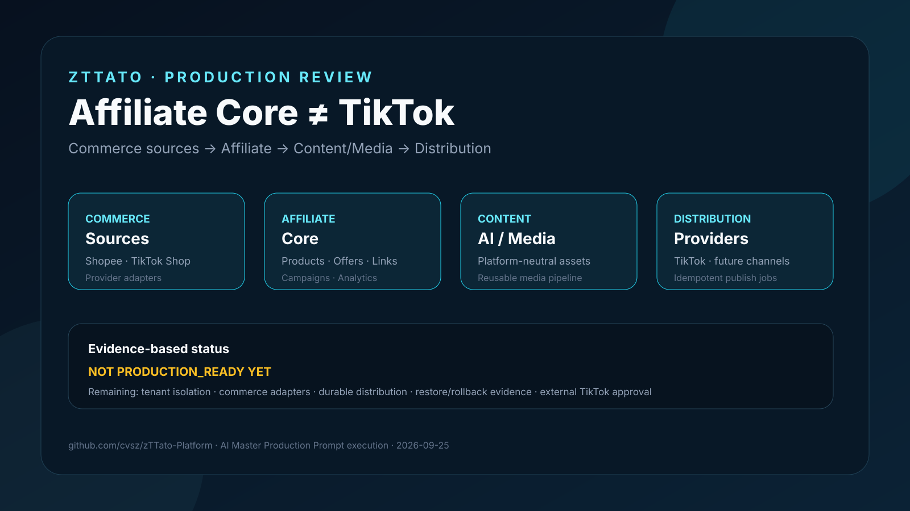

# zTTato Creator Platform

[](https://github.com/cvsz/zTTato-Platform/actions/workflows/ci.yml)
[](docs/PRODUCTION_GATES.md)
[](docs/AI_MASTER_PRODUCTION_PROMPT.md)
[](docs/ARCHITECTURE_BOUNDARIES.md)


First-party TikTok creator application for `https://zttato.zeaz.dev` using official Login Kit and Content Posting API. Includes server-side encrypted tokens, draft uploads, consent-based direct posting, creator-info and publishing-status checks, legal pages, tests, Docker Compose and operations runbooks.

> **STATUS:** implementation baseline; not TikTok-approved or verified production-ready. Run CI, real TikTok Sandbox review, legal signoff, isolated restore and deployment checks before launch.

## Architecture

zTTato is intentionally **not** a monolithic TikTok Affiliate application.

```text
Commerce Sources
      ↓
Product Ingestion / Normalization
      ↓
Affiliate Core
      ↓
Content / AI / Media
      ↓
Publishing Intent
      ↓
Distribution Providers
      ↓
Platform Analytics
      ↓
Affiliate Analytics
```

**Core rule:** Affiliate is the business domain. TikTok is one distribution integration. Shopee/TikTok Shop/etc. are commerce sources. Content, AI and media are reusable platform capabilities.

## Engineering Documentation

- [Universal AI Master Production-Grade Prompt](docs/AI_MASTER_PRODUCTION_PROMPT.md) — canonical execution prompt for OpenCode/Codex/Claude Code/Gemini CLI/Cursor/Copilot and equivalent engineering agents.
- [Scope & Responsibility Matrix](docs/SCOPE_AND_RESPONSIBILITY_MATRIX.md) — canonical ownership, dependency, failure-isolation and security matrix.
- [Architecture Boundaries](docs/ARCHITECTURE_BOUNDARIES.md) — mandatory separation of Commerce, Affiliate, Content/Media, Distribution and TikTok.
- [TikTok Review Evidence](docs/TIKTOK_REVIEW.md)
- [TikTok Media Transfer Contract](docs/TIKTOK_MEDIA_TRANSFER.md) — official FILE_UPLOAD chunking, upload destinations, tests and remaining real Sandbox evidence.
- [Operations](docs/OPERATIONS.md)
- [Production Gates](docs/PRODUCTION_GATES.md)
- [Release Protection](docs/RELEASE_PROTECTION.md) — branch/ruleset requirements, SBOM/vulnerability scan and artifact provenance release gate.
- [Migrations](docs/MIGRATIONS.md)

## Stack

Python 3.12+, FastAPI, SQLAlchemy, PostgreSQL 17, HTTPX, server-rendered legal pages and vanilla JS UI.

## Local Setup

1. Copy `.env.example` to `.env`.
2. Generate `APP_ENCRYPTION_KEY` using:
   `python -c "from cryptography.fernet import Fernet; print(Fernet.generate_key().decode())"`
3. Enter your own real TikTok Client Key/Secret and legal entity/contact/address values. Never commit `.env`.
4. Local app: `pip install -r requirements-dev.txt && uvicorn app.main:app --reload`
5. PostgreSQL: `docker compose up --build -d`
6. App: `/`
7. Review walkthrough: `/review-preview`
8. Legal: `/privacy-policy` and `/terms-of-service`
9. Creator dashboard: `/dashboard`

Register `https://zttato.zeaz.dev/tiktok/callback` as the exact Web Login Kit redirect URI if it is not already registered. Never silently change a registered redirect.

## TikTok Scope

This repository uses official Login Kit and Content Posting API only. Share Kit is not included. No scraping, password automation, CAPTCHA bypass or anti-detection mechanisms are permitted.

A development TikTok account is a test identity, not production approval. Sandbox evidence and external TikTok review must remain separate release gates.

## Architecture Review



> **Review snapshot — 2026-09-25:** zTTato is intentionally separated into Commerce Sources, Affiliate Core, Content/AI/Media and Distribution. The repository is **not** declared production-ready until the remaining evidence gates pass. See the [AI Master Prompt execution report](docs/AI_MASTER_PROMPT_EXECUTION_20260925.md).

## Production Readiness

Production readiness is an evidence claim, not a branch name or documentation statement. Use `PASS`, `FAIL`, `BLOCKED_EXTERNAL`, `NOT_TESTED` and `NOT_APPLICABLE` for release gates.

Affiliate readiness is independent of TikTok readiness. TikTok may remain `BLOCKED_EXTERNAL` while Affiliate Core is production-ready, provided unavailable TikTok capabilities are not advertised.

See [docs/PRODUCTION_GATES.md](docs/PRODUCTION_GATES.md) before every production release.
